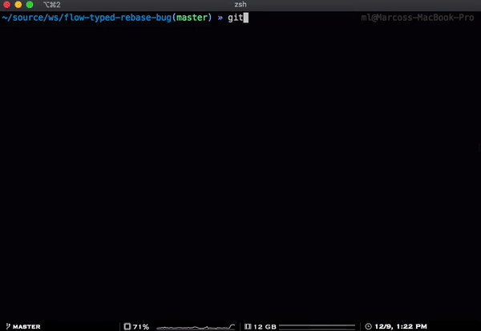

# Flow Typed Rebase Bug

[Flow Typed](https://github.com/flow-typed/flow-typed) is basically the community created types for either packages that are not typed with [Flow](https://flow.org/) or not typed at all, or that are poorly or wrongly typed.

## The bug

When rebasing a branch and running `flow-typed install`, it gets messy.

I know that _messy_ is not a very technical term, the problem is that _it depends_. The result may vary depending on certain conditions, in this repository example 1 commit is lost, and `master` is also rebased to match the `test` branch.




### How to reproduce

Before starting, note that the commit hashes will be different.

1. Clone this repository.

```sh
$ git clone https://github.com/mloureiro/flow-typed-rebase-bug
$ cd flow-typed-rebase-bug
```

2. Check the git log for `master` branch

```sh
$ git log --oneline master
fc22196 Random change 3
8359fbf Random change 2
5f6280a Random change
71605f1 Explain the issue
f464d9c Add random packages with flow-typed definitions
c061f4e Setup basic flow setup
0ef64ba Start
```

> **Note**: commit hashes might be differ

3. Check out to the `test` branch

```sh
$ git checkout test
```

4. Check the git log for test branch

```sh
$ git log --oneline test
1ec9ab3 Random change 3 - in 1st branch
e96f8cd Random change 2 - in 1st branch
33ee3c9 Random change 1 - in 1st branch
f464d9c Add random packages with flow-typed definitions
c061f4e Setup basic flow setup
0ef64ba Start
```

Here you can see that until _Add random packages with flow-typed definitions_ commit, both `master` and `test` branches shase same commits.

> **Note**: commit hashes might be differ

5. Rebase `test` on top of `master`

```sh
$ git rebase -i --exec "yarn run flow-typed install" master
```

Here we'll see the `flow-typed install` running, there will se some errors shown but the rebase will finish without failing.

6. Check the git log for `test` branch

```sh
$ git log --oneline test
521fc72 (HEAD -> test, master) Random change 3 - in 1st branch
ecc7766 Random change 2 - in 1st branch
66ca149 (origin/master) Random change 3
6e07595 Random change 2
8b071b3 Random change
0ca4616 Explain the issue
f464d9c Add random packages with flow-typed definitions
c061f4e Setup basic flow setup
0ef64ba Start
```

Here you can check that the commit _Random change **1** - in 1st branch_ was lost, and also that `master` is pointing to the same commit, just in case we can run the next step to make sure.

7. Check the git log for `master` branch

```sh
$ git log --oneline test
521fc72 (HEAD -> test, master) Random change 3 - in 1st branch
ecc7766 Random change 2 - in 1st branch
66ca149 (origin/master) Random change 3
6e07595 Random change 2
8b071b3 Random change
0ca4616 Explain the issue
f464d9c Add random packages with flow-typed definitions
c061f4e Setup basic flow setup
0ef64ba Start
```

Has I mention on the previous step, now `master` and `test` are exactly the same.

The expected result would be to have `master` branch untouched, and the log of `test` should be:


```sh
$ git log --oneline test
521fc72 (HEAD -> test) Random change 3 - in 1st branch
ecc7766 Random change 2 - in 1st branch
d875fca Random change 1 - in 1st branch
66ca149 (origin/master, master) Random change 3
6e07595 Random change 2
8b071b3 Random change
0ca4616 Explain the issue
f464d9c Add random packages with flow-typed definitions
c061f4e Setup basic flow setup
0ef64ba Start
```
